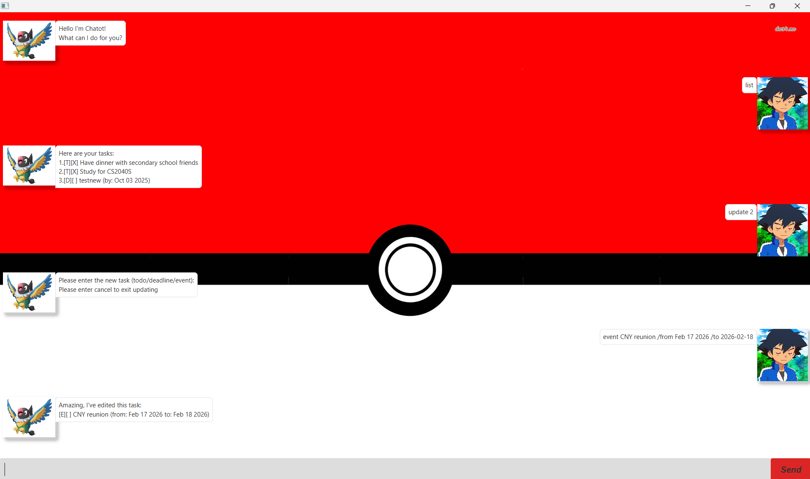

# Chatot User Guide



Chatot is a personal task management application that helps you organize your todos, deadlines, and events through a simple command-line interface with a JavaFX GUI. Named after the chatty Pokémon, Chatot makes task management fun and interactive!

Chatot allows you to manage three types of tasks:
- **Todos**: Simple tasks without any time constraints
- **Deadlines**: Tasks that need to be completed by a specific date
- **Events**: Tasks that occur during a specific time period

## Adding todos

Add a simple task without any time constraints.

Example: `todo read book`

Creates a new todo task with the given description.

```
Got it. I've added this task: 
[T][ ] read book
Now you have 1 tasks in the list.
```

## Adding deadlines

Add a task that needs to be completed by a specific date.

Example: `deadline submit report /by 2024-12-15`

Creates a new deadline task with the specified due date. The date can be in format `yyyy-MM-dd` or `MMM dd yyyy`.

```
Got it. I've added this task: 
[D][ ] submit report (by: Dec 15 2024)
Now you have 2 tasks in the list.
```

## Adding events

Add a task that occurs during a specific time period with start and end dates.

Example: `event project meeting /from 2024-12-10 /to 2024-12-12`

Creates a new event with the specified start and end dates. Both dates can be in format `yyyy-MM-dd` or `MMM dd yyyy`.

```
Got it. I've added this task: 
[E][ ] project meeting (from: Dec 10 2024 to: Dec 12 2024)
Now you have 3 tasks in the list.
```

## Listing tasks

Display all tasks in your current task list.

Example: `list`

Shows all tasks with their completion status and details.

```
Here are your tasks: 
1.[T][ ] Have dinner with secondary school friends
2.[T][X] Study for CS2040S
3.[D][ ] testnew (by: Oct 03 2025)
```

## Marking tasks as done

Mark a task as completed using its list number.

Example: `mark 1`

Marks the specified task as done (shows [X] instead of [ ]).

```
Nice! I've marked this task as done:
[T][X] read book
```

## Unmarking tasks

Mark a completed task as not done using its list number.

Example: `unmark 1`

Changes the task status back to not completed.

```
OK, I've marked this task as not done yet:
[T][ ] read book
```

## Deleting tasks

Remove a task from your list using its list number.

Example: `delete 2`

Permanently removes the specified task from your list.

```
Noted. I've removed this task:
[D][ ] submit report (by: Dec 15 2024)
Now you have 2 tasks in the list.
```

## Finding tasks

Search for tasks containing specific keywords.

Example: `find book`

Displays all tasks that contain the search keyword in their description.

```
Here are your tasks: 
1.[T][ ] read book
```

## Updating tasks

Modify an existing task by replacing it with a new task.

Example: `update 2`

Prompts you to enter a new task (todo/deadline/event) to replace the existing one.

```
Please enter the new task (todo/deadline/event):
Please enter cancel to exit updating
```

After entering the update command, you can then provide a new task:
- `todo finish homework` - replaces with a new todo
- `deadline complete assignment /by 2024-12-20` - replaces with a new deadline
- `event CNY reunion /from Feb 17 2026 /to 2026-02-18` - replaces with a new event
- `cancel` - cancels the update operation

When successfully updated:

```
Amazing, I've edited this task:
[E][ ] CNY reunion (from: Feb 17 2026 to: Feb 18 2026)
```

## Exiting the application

Close the application and save your tasks.

Example: `bye`

Saves all tasks to file and closes the application.

```
Bye. Hope to see you again soon!
```

## Data persistence

Chatot automatically saves your tasks to `./data/taskHistory.txt` and loads them when you restart the application. If no previous data exists, a new task list will be created.

## Error handling

Chatot provides helpful error messages for common issues:
- Invalid date formats
- Missing task descriptions
- Invalid task indices
- Missing required command arguments

All tasks are automatically saved when you exit the application, ensuring your data persists between sessions.

## Features demonstrated in the interface

The screenshot shows Chatot in action with:
- A welcoming message from Chatot
- A list of existing tasks including todos and deadlines
- The update functionality being used to modify task 2
- Real-time feedback when tasks are successfully updated
- A clean, Pokemon-themed interface with Chatot's signature colors

Chatot makes task management engaging with its friendly personality and intuitive command structure!